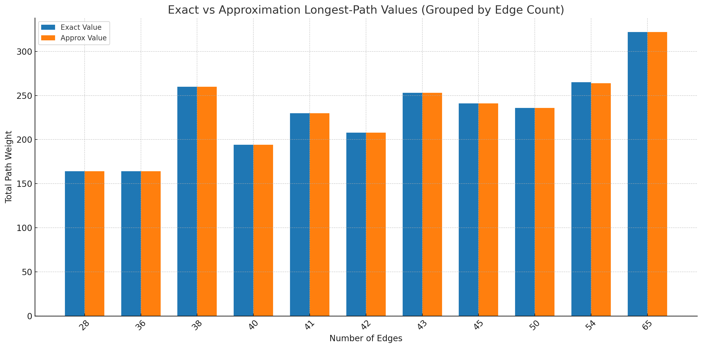

# High-Level Approximation Strategy

The algorithm combines **three major ideas**:
1. Greedy Construction  
2. Randomized Escape  
3. Anytime / Multi-Start Search  

---

# Greedy Construction (Pseudocode)

``` python
def greedy_step(G, current, visited):
    # All neighbors not yet visited
    candidates = [v for v in G[current] if v not in visited]
    if not candidates:
        return None

    def score(v):
        deg = len(G[v]) # degree(v)
        unvisited = sum(1 for u in G[v] if u not in visited)
        return (deg, unvisited)

    # Pick the candidate with maximum score
    return max(candidates, key=score)

```

---

# Randomized Escape (Pseudocode)

``` python
def random_escape(G, current, visited, JUMP_PROB):
    if random.random() < JUMP_PROB:
        unvisited = [v for v in G if v not in visited]
        return random.choice(unvisited) if unvisited else None

    nbrs = list(G[current])
    return random.choice(nbrs) if nbrs else None

```

---

# Random Walking (Pseudocode)

``` python
def random_walk(G, start, max_steps):
    path = [start]
    current = start

    for _ in range(max_steps):
        nbrs = list(G[current])
        if not nbrs:
            break

        nxt = random.choice(nbrs)
        path.append(nxt)
        current = nxt

    return path
```

---

# Runtime Analysis of `sample_path` (Single Iteration)

We analyze the **worst‑case time complexity** of one call to:

```
sample_path(graph, n, start)
```

Let:

- **V = number of vertices**
- **E = number of edges**

---

## Greedy Phase

At each step:

- We scan all neighbors of the current vertex to extract unvisited ones  
- Worst‑case per step: **degree(v)**  
- Across entire run, every vertex is visited at most once → total neighbor scans:

### **O(deg(v)) = O(E)**

---

## Random Walk Extension

The random walk runs for **WALK_STEPS**, which is a constant:
Each of the vertices gathers unvisited neighbors **O(E)**

### **O(1 + E) = O(E)**

---

# Overall Worst-Case Runtime

`T_sample(V, E) = O(E) + O(E) = O(E)`

Since edges dominate, a single sampled greedy+random-walk path runs in **linear time in the number of edges**.

---

new.png)

--- 

new.png)

---


