# **The Longest Path Problem**

**Computational Complexity Analysis**

---

# Longest Path Problem

**Input**: Weighted graph $G = (V, E, w)\ \text{where}\ w: E \to \mathbb{R}^{+}$

```
8 15 # Vertices, Edges
v2 v1 5 # vertex, vertex, weight
...
```

**Output**: A simple path P with maximum sum of edge weights

```
115
v5 v4 v7 v8 v3 v1 v6 v2
```

**Optimization Version (NP-Hard)**: Given a weighted graph, find the simple path with maximum total weight.

**Descision Version (NP-Complete)**: Given a weighted graph, does a simple path of weight $\geq k$ exist?

---

# Shortest vs Longest Path

Why can't we use a shortest path algorithm like Bellman-Ford (Polynomial) to solve Longest Path?

**Attempt #1 - Negate every weight**:
Definitionally, Shortest Path is _not_ required to be simple, Longest Path _is_.

- Bellman-Ford will stop if it encounters a negative weight cycle to prevent an infinite loop.
- Even in the presence of a positive weight cycle, verticies in Longest Path can not be repeated and so it will never loop.

**Note**: Allowing repeated veritices and positive weight cycle detection in Longest Path would make it polynomial. Conversely, requiring Shortest Path to be simple would make it NP-Hard.

---

# Shortest vs Longest Path

Why can't we use a shortest path algorithm like Bellman-Ford (Polynomial) to solve Longest Path?

**Attempt #2 - Use reciprocal weights**:
This doesn't work either because the reciprocal of a sum is not equal to the sum of reciprocals (e.g. $\frac{1}{2 + 3} \neq \frac{1}{2} + \frac{1}{3}$)

**Counter-Example**

- Path A: $w_1 = 1, w_2 = 4$
- Path B: $w_3 = 2, w_2 = 2$

Longest Path: $(1 + 4) > (2 + 2) \therefore\ \text{Longest Path:}\ (w_1, w_2)$
Shortest Path + Reciprocals: $(1 + \frac{1}{4}) > (\frac{1}{2} + \frac{1}{2}) \therefore\ \text{Longest Path:}\ (w_3, w_4)$

---

# NP (Certificate Verification)

**Certificate**: A sequence of vertices P = [v₁, v₂, ..., vₘ] claimed to be a longest path

```python
def verify_longest_path(G, certificate, k):
    # Check 1: O(|P|) - All vertices in certificate are unique (simple path)
    if len(certificate) != len(set(certificate)):
        return False

    # Check 2: O(|P|) - All consecutive pairs form edges in G
    total_weight = 0 # Accumulator
    for i in range(len(certificate) - 1):
        edge = G.get_edge(certificate[i], certificate[i+1])
        if edge is None: # Verify edge exists in graph
            return False

        total_weight += edge.weight

    # Check 3: O(1) - Total path weight ≥ k
    return total_weight >= k
```

---

# NP-Hardness

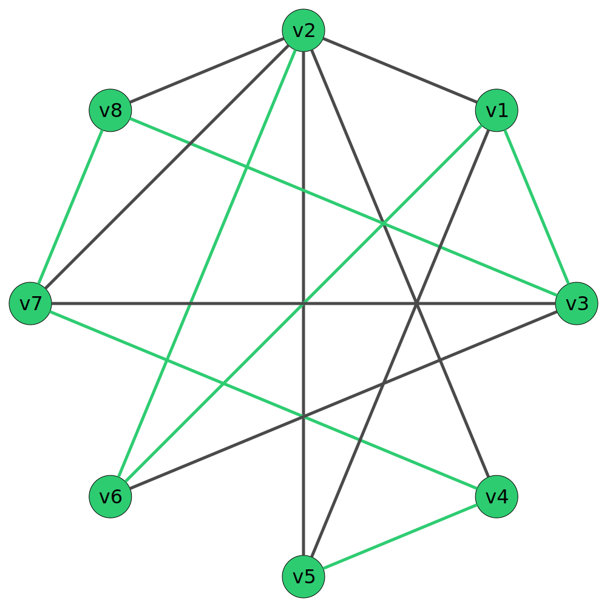

**Hamiltonian Path Problem** (known NP-Complete):

- Input: Unweighted Graph $G = (V, E)$
- Output: A path visiting every vertex exactly once (if it exists)

**Reduction Strategy:** Hamiltonian Path $\leq_p$ Longest Path

If the Hamiltonian Path Poblem can be reduced to Longest Path in polynomial time, then the Longest Path problem is also NP-Hard.

---

# Reduction

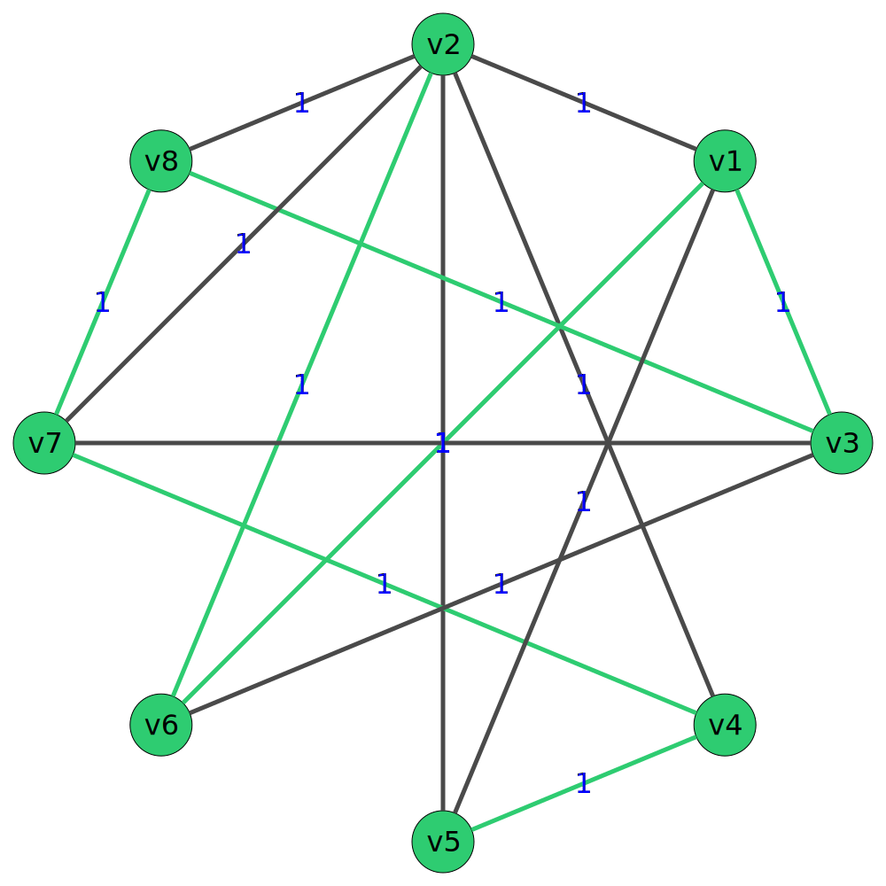

**Reduce Hamiltonian Path → Longest Path in polynomial time:**

Assign every edge in the graph a weight of 1.
$G = (V, E) \to G = (V, E, w)\ \text{where}\ w: E \to 1$. $O(|E|)$

**Reframe decision:**

Does a path of total weight $\geq |V| - 1$ exist?

- If YES, then the path found by Longest Path is a Hamiltonian path.
- If NO, then no Hamiltonian Path exists.

---

# Reduction Correctness

**Forward (⇒):** If $G$ has Hamiltonian path $P$:

- $P$ visits all vertices exactly once
- $P$ uses exactly $|V| - 1$ edges.
- All edges have weight 1 so the total weight of $P$ is $|V| - 1$
- Thus there exists a simple path of total weight $\geq |V| - 1$, so Longest Path answers YES ✓

---

# Reduction Correctness

**Backward (⇐):** If Longest Path returns path $P$ of weight $\geq |V| - 1$:

- $P$ is simple (no repeated vertices)
- $P$ uses exactly $|V|$ vertices in a graph with $|V|$ total vertices
- Therefore $P$ visits every vertex exactly once
- $P$ is a Hamiltonian path ✓

**Conclusion:** Reduction runs in polynomial time, therefore, because Hamiltonian Path is NP-Complete, Longest Path is NP-Hard

---

# Implementation (Simplified)

```python
# graph: dict[int, dict[int, float]]

def recurse(
    start: int, weight: float, visited: list[bool]
) -> tuple[list[int], float]:
    # ...

    for adj in graph[start].keys():
        if visited[adj]:
            continue
        # DOMINANT OPERATION: Recursive exploration
        new_path, new_weight = recurse(adj, weight + graph[start][adj], visited)
        # ...

        if new_weight > best_weight:
            best_weight = new_weight
            new_path.insert(0, start)
            best_path = new_path

    return (best_path, best_weight)
```

---

# Analytical Runtime Analysis

**Worst Case (Complete Graph) Analysis:**

- Start from each of $n$ vertices: $O(n)$
- At each vertex, try extending to each unvisited neighbor
- At depth $d$, we have $d$ visited vertices, $(n - d)$ unvisited
- Total simple paths explored: $n \cdot (n-1) \cdot (n-2) \cdot \ldots \cdot 1 = n!$
- Total: $O(n! \cdot n) = O(n!) = O(|V|!)$

**Dominant Operation:** Recursive call exploring all possible paths

This factorial runtime is the dominant term and confirms the exponential nature of the problem

---

<style scoped>
  table {
    font-size: 1.4rem;
  }
</style>

# Empirical Runtime Analysis

**Test Setup:** Test cases timed with zsh time built-in

| Test Case  | Vertices | Edges | Time - Python | Time - Rust | Test Case  | Vertices | Edges | Time - Python | Time - Rust |
| ---------- | -------- | ----- | ------------- | ----------- | ---------- | -------- | ----- | ------------- | ----------- |
| lp_172.txt | 15       | 28    | 0:00.159      | 0:00.004    | lp_136.txt | 19       | 43    | 0:13.131      | 0:00.174    |
| lp_083.txt | 11       | 36    | 0:01.509      | 0:00.027    | lp_175.txt | 17       | 45    | 0:34.522      | 0:00.429    |
| lp_156.txt | 20       | 38    | 0:01.195      | 0:00.020    | lp_135.txt | 18       | 50    | 1:06.896      | 0:00.720    |
| lp_100.txt | 12       | 40    | 0:05.613      | 0:00.080    | lp_151.txt | 21       | 54    | 3:55.820      | 0:02.478    |
| lp_152.txt | 16       | 41    | 0:08.921      | 0:00.119    | lp_108.txt | 21       | 65    | DNF (>20min)  | 2:02.490    |
| lp_101.txt | 16       | 42    | 0:12.165      | 0:00.177    |            |          |       |               |             |

---

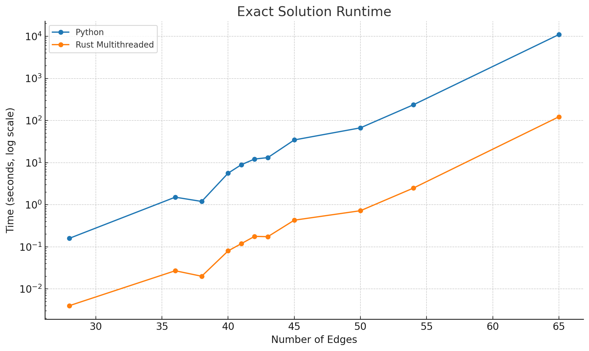

---

# High-Level Approximation Strategy

The algorithm combines **two major ideas**:

1. Greedy
2. Random Exploration

---

# Greedy Construction

```python
def GREEDY_STEP(G, current, visited):
    # All neighbors of current that are not yet visited
    candidates = [v for v in G[current] if v not in visited]
    if not candidates:
        return None

    # Score(v): degree + number of unvisited neighbors
    def SCORE(v):
        degree = len(G[v])
        unseen = sum(1 for u in G[v] if u not in visited)
        return (degree, unseen)

    # Return the candidate with maximum score
    return max(candidates, key=SCORE)

```

---

# Random Exploration

```python
def RANDOM_EXPLORE(G, current, visited, JUMP_PROB):
    r = random.random()      # number in [0, 1)

    # With probability JUMP_PROB, explore randomly
    if r < JUMP_PROB:
        candidates = [v for v in G[current] if v not in visited]
        if not candidates:
            return None
        return random.choice(candidates)

    # Otherwise, follow greedy rule
    return GREEDY_STEP(G, current, visited)
```

---

# Runtime Analysis of `sample_path`

We analyze the worst-case runtime of one greedy + random-jump path.

At each step:

- Scan all neighbors of the current vertex → **O(degree(current))**
- Filter unvisited neighbors
- Pick best-weight or random-choice → **O(1)**

Each vertex becomes `current` at most once,
so each edge is scanned at most **twice**.

---

## Overall Worst-Case Runtime

Total neighbor scanning:

degree(v₁) + degree(v₂) + … + degree(vₙ)
= **2E = O(E)**

Thus:

**T_sample(E) = O(E)**

Each sampled path runs in  
**linear time in the number of edges.**

---

new.png>)
new.png>)

---

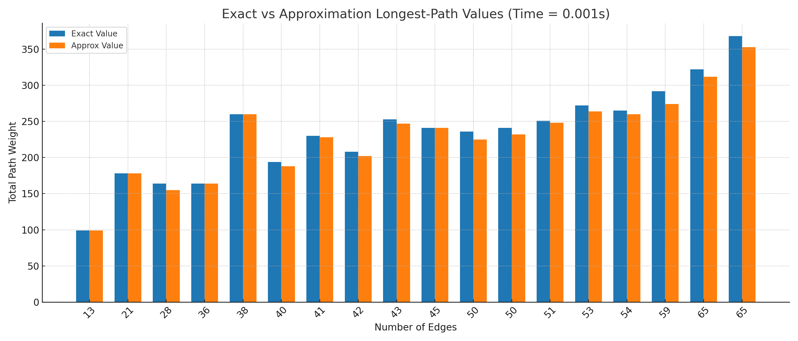

---

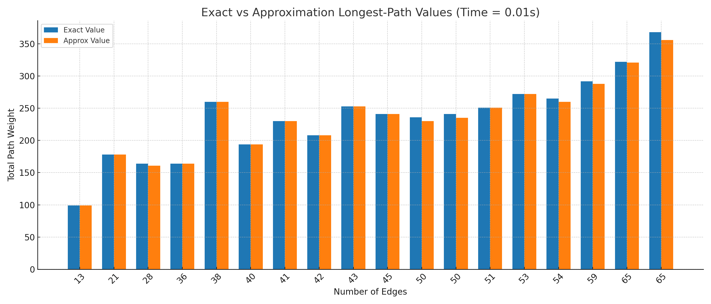

---


---

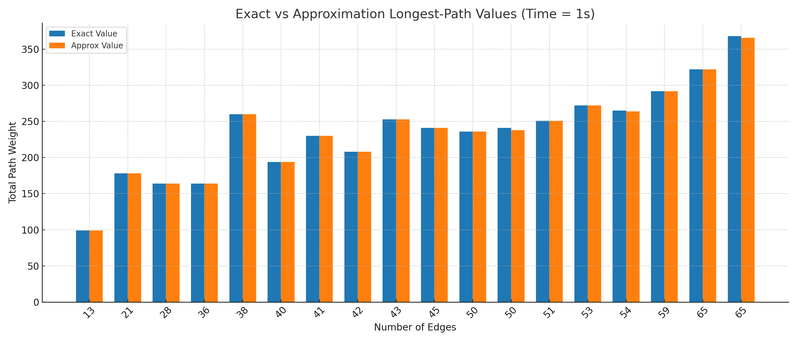

---

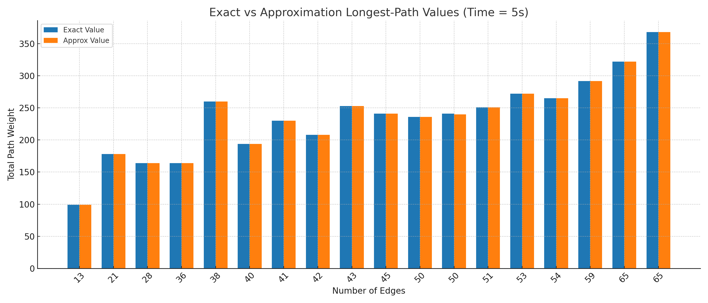

---

# Anytime Approximation Strategy

The algorithm has **two main components**:

1. Greedy Top-k Selection
2. Random Edge Selection

---

# Greedy Top-k Selection (Pseudocode)

```python
    # Only consider unvisited neighbors
    candidates = [(neighbor, weight)
                    for neighbor, weight in graph[current_vertex].items()
                    if neighbor not in visited_vertices]

    if not candidates:
                break

    # pick randomly from top-k heaviest using heapq.nlargest
    top_k_candidates = heapq.nlargest(k, candidates, key=lambda x: x[1])
    neighbor, weight = random.choice(top_k_candidates)

    visited_vertices.add(neighbor)
    current_path.append(neighbor)
    current_weight += weight
    current_vertex = neighbor

```

---

# Random Edge Selection (Pseudocode)

```python
    # Only consider unvisited neighbors
    candidates = [(neighbor, weight)
                    for neighbor, weight in graph[current_vertex].items()
                    if neighbor not in visited_vertices]

    if not candidates:
        break

    # probability set to 0.3 by default
    if random.random() <= probability:
        neighbor, weight = random.choice(candidates)
    else:
        # pick heaviest neighbor in linear time using max
        neighbor, weight = max(candidates, key=lambda x: x[1])

    visited_vertices.add(neighbor)
    current_path.append(neighbor)
    current_weight += weight
    current_vertex = neighbor

```

---

# Runtime Analysis of the Algorithm

**Let:**

**n** = number of vertices

**E** = number of edges

**Δ** = max degree of a vertex

---

# Top-K Selection Runtime

- **Per vertex iteration**:
  - Scan neighbors: O(Δ) (Δ = degree of current vertex)
  - Pick top-k using heapq.nlargest: O(Δ)
  - Random choice from top-k: O(1)

- **Total Runtime**:
  - Worst-case O(Δ) = **O(E)**

---

# Random Edge Selection Runtime

- **Per vertex iteration**:
  - Scan neighbors: O(Δ)
  - Random pick: O(1) or max by weight: O(Δ)

- **Total Runtime**:
  - Worst-case O(Δ) = **O(E)**

---

# Anytime Algorithm Total Runtime

- Top-k Selection **O(E)** + Random Edge Selection **O(E)** = **O(E)**
- Algorithm repeats these iterations until time limit is reached,
- **Total Runtime Per Iteration:** O(E)

- **Total Runtime:** unbounded (anytime nature)
  - Can run as long as needed, producing progressively better solutions

---

# Calculating an Upper Bound

Use a **Maximum Spanning Tree**:

- A spanning tree connects all n vertices using exactly n-1 edges
- An MST is the spanning tree with maximum total weight among all trees
- The **Longest Simple Path Weight <= Maximum Spanning Tree Weight**

---

# Patrick's Runtime VS Alston's Runtime

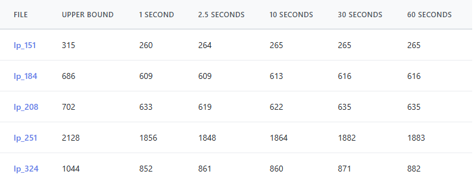
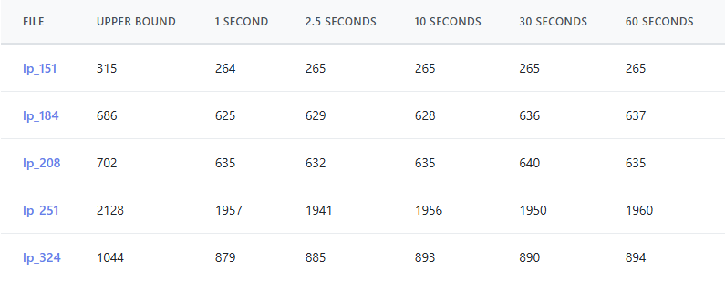

- Calculated upper bound using **Maximum Spanning Tree**
- Randomness can cause worse results even with more runtime
- Less improvements after 30 seconds

---

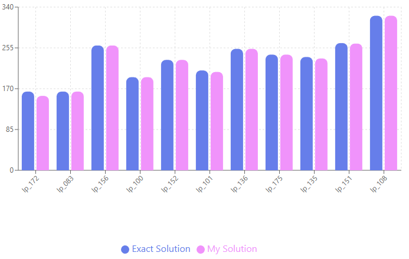

---

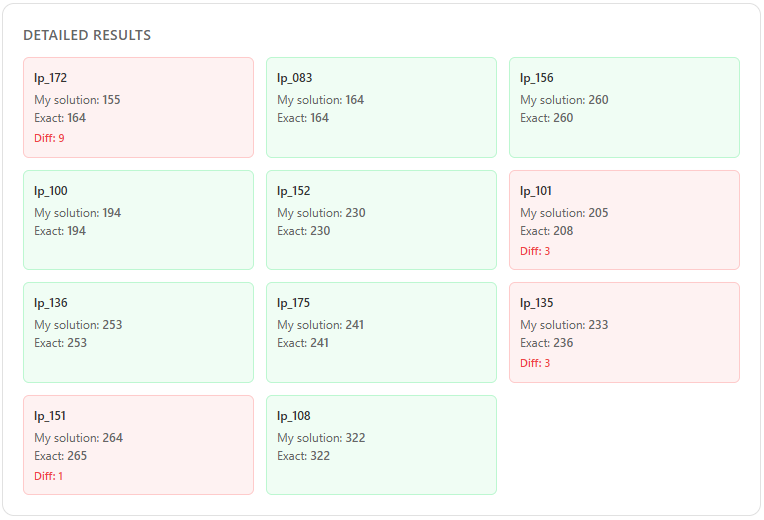
